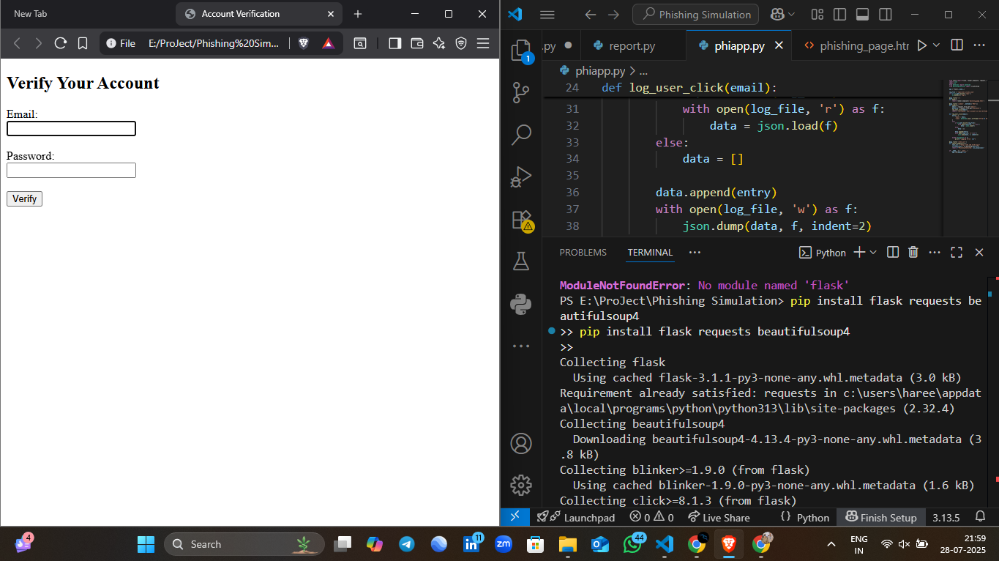
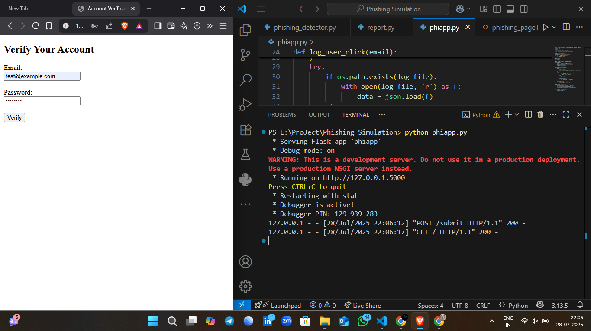
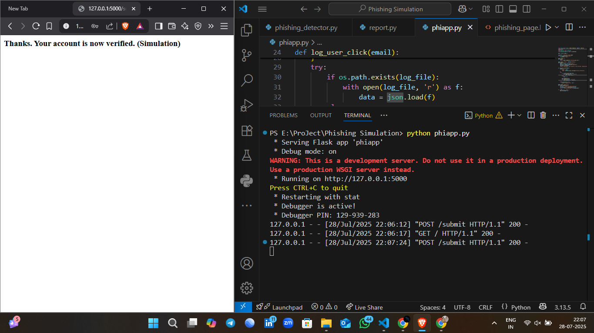
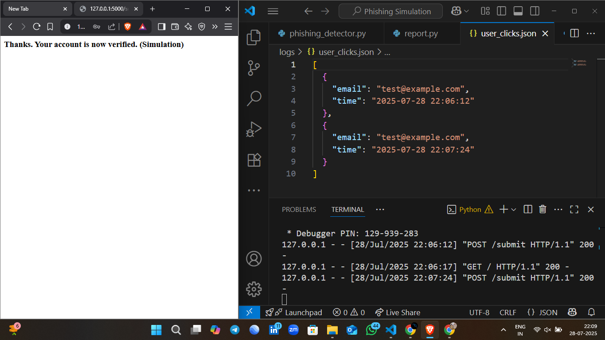
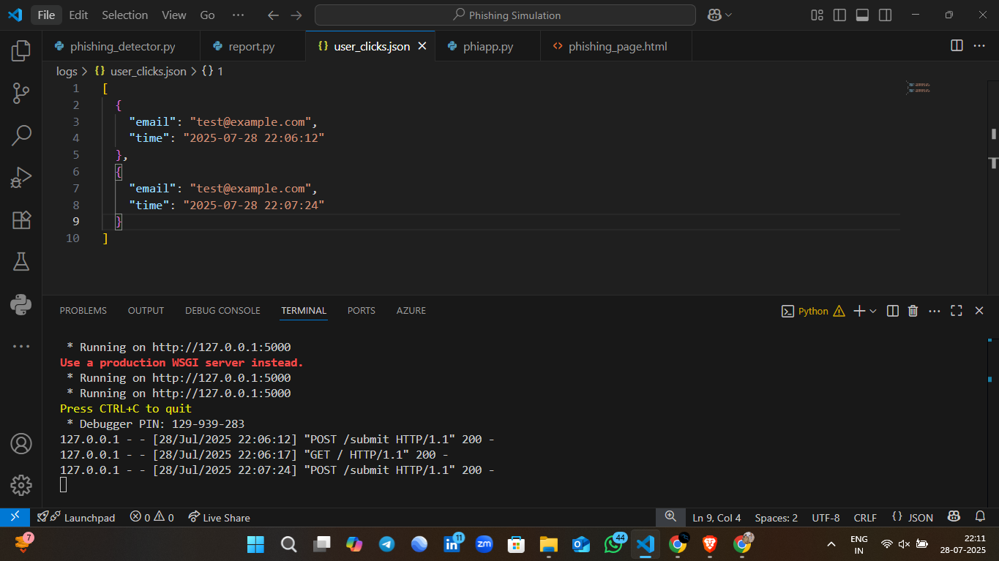

<h1 align="center">🎯 Phishing Simulation System 🎯</h1>

<p align="center">
  
  
  
  
</p>

---

> ⚠️ **Educational Use Only!**  
> This phishing simulation is for cybersecurity awareness & ethical training purposes only.

---

## 🧠 Objective

🎯 Simulate phishing attacks in a safe, controlled environment to:
- 👁️ Raise awareness
- 🧑‍💻 Log user responses
- 🛡️ Detect suspicious behavior or URLs
- 📊 Generate simple reports from captured data

---

## ⚙️ Tech Stack

| Language | Framework | Parsing | HTTP | Frontend | Data Format |
|----------|-----------|---------|------|----------|-------------|
| Python 🐍 | Flask ⚗️ | BeautifulSoup 🍜 | Requests 🌐 | HTML/CSS 🎨 | JSON 📁 |

---

## 🚀 Key Features

✨ Fake Login Page Simulation  
📩 Capture Email + Password (simulation only)  
📜 Log to `logs/user_clicks.json`  
🕵️‍♂️ Phishing Detection from URLs  
📑 Reporting via `report.py`  
🎯 Simple, minimal UI (customizable)

---

## 🔄 [Hareesh Kumar ]([url](https://www.linkedin.com/in/hareesh-kumar-02045a339/))


---

## 🖼️ Screenshots

### 🖥️ Home Page – Fake Login  


### 🧾 User Inputs Credentials  


### 📂 JSON Logs  


### 🛡️ URL Phishing Detection  


### 📊 Report Output  


---

## 🔧 Installation & Run

```bash
# 1. Clone this repository
git clone https://github.com/yourusername/phishing-simulation.git
cd phishing-simulation

# 2. Install dependencies
pip install flask requests beautifulsoup4

# 3. Run the app
python app.py

# 4. Visit
http://127.0.0.1:5000


